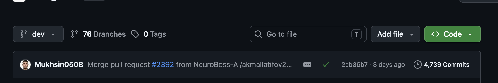

# AllMetrix — AI Business Operating System

*Our production monorepo (private): **4,739 commits**, **76 branches**, shipped and
maintained daily by the OpenMetrix team.*

---

**AllMetrix** is an AI-powered business management platform delivered through Telegram.
Every employee in an organization — founder, manager, or specialist — works with a
personal AI agent that plans their day, tracks tasks and business metrics, coordinates
the team, and remembers everything the organization has ever discussed.

The platform is **closed-source**. This repository accompanies our President Tech Award
application as a technical overview; deeper source access for the evaluation committee
can be arranged on request. See [`NOTICE.md`](NOTICE.md) for terms.

---

## What the product does

- **Role-aware AI agents** — each employee gets an agent matched to their role
  (Founder / Manager / Specialist), with permissions and capabilities to match
- **Daily operating rhythm** — automated morning briefings and evening reviews,
  delivered in each employee's own timezone and working hours
- **Tasks, reminders, and team coordination** — assignment, overdue tracking,
  cross-team reporting, and proactive nudges
- **Business metrics** — employees log metrics conversationally; founders get
  plans-vs-facts analytics and statistics reports
- **Long-term organizational memory** — the AI recalls decisions, facts, and context
  from the organization's entire history
- **External integrations** — Google Sheets, CRMs, and other business tools connected
  directly by the agent through our integration hub
- **Voice and media** — voice messages (speech-to-text and spoken replies), photos,
  documents, and video understood natively
- **Multi-language** — English, Russian, and Uzbek
- **Multi-tenant by design** — every query and scheduled job is strictly scoped to the
  organization

## Technology stack

- **Python 3.13** · FastAPI · SQLAlchemy (async) · Alembic · Pydantic
- **LangGraph / LangChain** agent runtime with a multi-provider LLM strategy
  (Google Gemini, Anthropic Claude, OpenAI)
- **PostgreSQL** · **Redis** · **Qdrant** (vector search) · **MongoDB**
- **BGE-M3** self-hosted embedding & reranking inference service
- **Celery** for distributed scheduling and background jobs
- **python-telegram-bot** client surface; Whisper STT and TTS for voice
- **Docker Compose** deployment

## Observability

Production issues in an AI product are invisible without deep instrumentation, so
observability is a first-class subsystem of the platform:

- **Langfuse & LangSmith** — end-to-end tracing of every agent turn, LLM call, and
  tool execution, with prompt/response capture for debugging and quality review
- **Sentry** — real-time error monitoring across the API, bot, and background workers
- **Prometheus** — service health and business metrics exported from every component
- **Structured logging** (Loguru) — key-value logs correlated across services
- **LLM cost accounting** — per-provider token and cost tracking on every model call,
  feeding weekly cost and usage reports
- **Scheduler heartbeats** — liveness monitoring of the background job dispatcher, so
  silent scheduling failures page us instead of the customer noticing

## Engineering practice

- 4,700+ commits of continuous delivery in a single production monorepo
- Pull-request workflow with automated AI code review on every PR
- Typed, linted, formatted codebase (`mypy`, `ruff`, `black`) with a production test
  suite covering multi-tenancy isolation and retrieval quality
- Full observability: structured logging, per-call LLM tracing, and cost accounting

---

© OpenMetrix Inc. All rights reserved. See [`NOTICE.md`](NOTICE.md).
